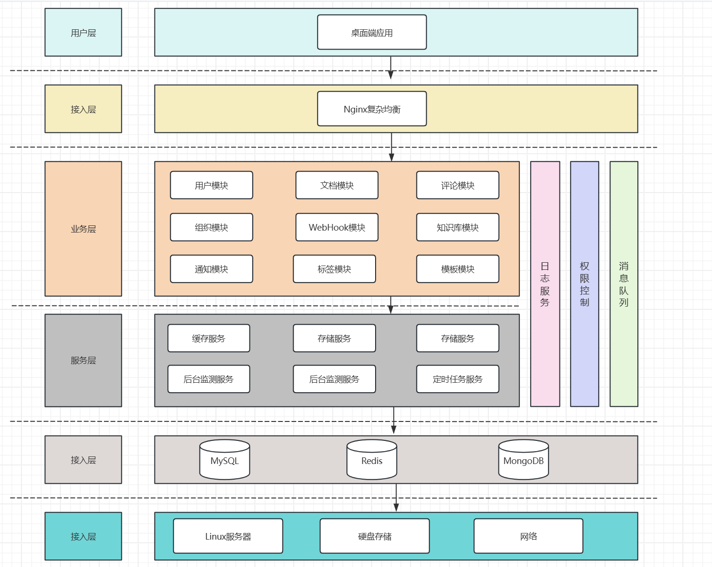

# CoWrite

## 🚀 Project Introduction

CoWrite is a real-time document collaboration platform for technical teams, content organizations and knowledge-based enterprises. It has the use experience of linguaque/Notion and supports:

- Multi-person online editing collaboration
- document structure tree management
- Template-label system
- Fine-grained access control
- Comments/Audit Log

---

## 🎯 Core highlights

- 🧩 Document collaboration model is complete : knowledge base, documents, comments and versions.
- 🔄 Real-time editing capability (WebSocket/OT) reservation
- 🔐 Permission control granularity to document level
- 📦 Template and tag system make documents reusable and organized
- 🔔 Notification Center+Webhook External Integration
- 📜 Operation log audit, ensuring that the content can be traced

---

health endpoint: http://localhost:8080/actuator/health

### Architecture diagram

